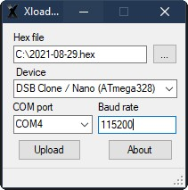

# Update procedure

## Requirements

* Windows computer.
* The hex file. It can be found in the [Release](../Releases/) folder in this repository.
* Xloader software. It can be fround in the [Tools](../Tools/) folder.
* USB cable to link the Arduino Nano to computer. This should be a USB A to mini-USB.

## Procedure

1. Unplug the Arduino from the DSBClone board.
2. Unzip all softwares on your computer.
3. Attach the Arduino to your computer using appropriate USB cable. Wait for the drivers to install. If it ask for drivers, search libusb0.dll in the Xloader archive.
4. Start XLoader.exe program.

6. Setup Xloader

    * Click on the 3 dots "..." to select the hex file.
    * Select "DSBClone" device.
    * Select COM port corresponding to the Arduino board.
    
7. Click "Upload".

During update a LED should blink on the Arduino. It usually takes 10s to update.

